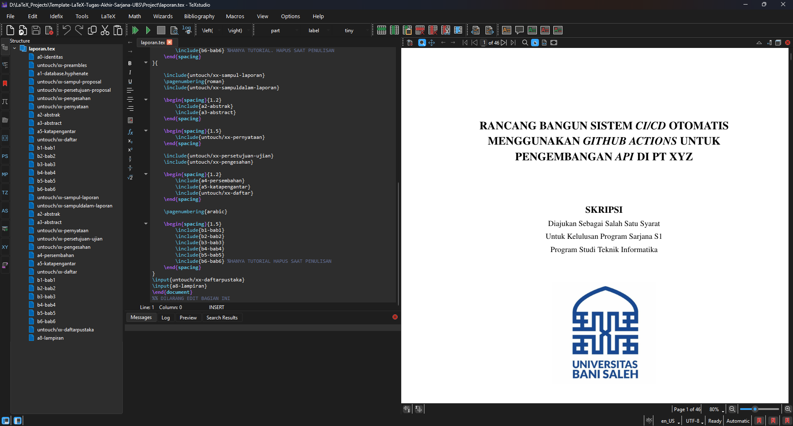

# 📘 Template LaTeX Laporan Tugas Akhir

*Program Sarjana Teknik Informatika – Universitas Bani Saleh*

Template ini dirancang untuk mempermudah penulisan Proposal dan Laporan Tugas Akhir bagi mahasiswa S1 Teknik Informatika Universitas Bani Saleh. Template ini memastikan keseragaman format, efisiensi penulisan, serta kemudahan kolaborasi dan pengelolaan dokumen melalui Git atau Overleaf.

> **Catatan**: Template ini akan dikembangkan lebih lanjut untuk mendukung program studi lain (sarjana & diploma) di Fakultas Teknologi dan Informasi Digital, Universitas Bani Saleh.

---

## 📁 Struktur Proyek

```text
Template-LaTeX-Tugas-Akhir-Sarjana-UBS
├── CHANGELOG                         # Catatan perubahan versi
├── LICENSE                           # Lisensi proyek (MIT License)
├── Project                           # Folder proyek utama
│   ├── a0-identitas.tex              # Identitas penulis dan laporan
│   ├── a1-database.hyphenate.tex     # Database untuk hyphenation
│   ├── a6-daftarsingkatan.tex        # Daftar singkatan dan istilah
│   ├── a7-pustaka.bib                # Daftar pustaka (BibTeX)
│   ├── a8-lampiran.tex               # Lampiran dokumen
│   ├── a9-daftarriwayathidup.tex     # Daftar riwayat hidup penulis
│   ├── b6-bab6.tex                   # BAB VI - Tutorial LaTeX (opsional)
│   ├── gambar                        # Folder penyimpanan gambar
│   │   ├── ci-ilustrasi.png
│   │   ├── foto-penulis.png
│   │   ├── gambar-kucing.jpg
│   │   ├── logo-ubs.png
│   │   ├── screenshot-miktex.png
│   │   ├── screenshot-overleaf.png
│   │   └── screenshot-texstudio-windows.png
│   ├── kode                          # Folder penyimpanan kode program
│   │   ├── code_sample.cpp
│   │   ├── code_sample.ino
│   │   ├── code_sample.java
│   │   └── code_sample.py
│   ├── laporan                       # Folder khusus Laporan KKP/TA
│   │   ├── konten-pelengkap          # Konten pelengkap laporan
│   │   │   ├── a2-abstrak.tex        # Abstrak Bahasa Indonesia (tidak digunakan)
│   │   │   ├── a3-abstract.tex       # Abstrak Bahasa Inggris (tidak digunakan)
│   │   │   ├── a4-persembahan.tex    # Halaman persembahan
│   │   │   └── a5-katapengantar.tex  # Kata pengantar
│   │   ├── konten-utama              # Konten utama laporan (BAB I-V)
│   │   │   ├── b1-bab1.tex           # BAB I - Pendahuluan
│   │   │   ├── b2-bab2.tex           # BAB II - Tinjauan Organisasi
│   │   │   ├── b3-bab3.tex           # BAB III - Metode Penelitian
│   │   │   ├── b4-bab4.tex           # BAB IV - Penutup
│   │   │   └── b5-bab5.tex           # Tidak digunakan
│   │   └── untouch                   # File template (jangan diubah)
│   │       ├── xx-daftar-hadir.tex
│   │       ├── xx-daftar-penilaian-dosen-pembimbing.tex
│   │       ├── xx-daftar-penilaian-pembimbing-lapangan.tex
│   │       ├── xx-daftar.tex
│   │       ├── xx-pengesahan-laporan.tex
│   │       ├── xx-sampul-laporan.tex
│   │       └── xx-sampuldalam-laporan.tex
│   ├── laporan.pdf                   # Hasil kompilasi laporan
│   ├── laporan.tex                   # File utama kompilasi laporan
│   ├── proposal                      # Folder khusus Proposal
│   │   ├── konten-pelengkap          # Konten pelengkap proposal
│   │   │   ├── a2-abstrak.tex        # Abstrak Bahasa Indonesia
│   │   │   ├── a3-abstract.tex       # Abstrak Bahasa Inggris
│   │   │   ├── a4-persembahan.tex    # Halaman persembahan
│   │   │   └── a5-katapengantar.tex  # Kata pengantar
│   │   ├── konten-utama              # Konten utama proposal (BAB I-V)
│   │   │   ├── b1-bab1.tex           # BAB I - Pendahuluan
│   │   │   ├── b2-bab2.tex           # BAB II - Tinjauan Pustaka
│   │   │   ├── b3-bab3.tex           # BAB III - Metode Penelitian
│   │   │   ├── b4-bab4.tex           # BAB IV - Hasil dan Pembahasan
│   │   │   └── b5-bab5.tex           # BAB V - Kesimpulan dan Saran
│   │   └── untouch                   # File template (jangan diubah)
│   │       ├── xx-daftar.tex
│   │       ├── xx-pengesahan-proposal.tex
│   │       ├── xx-pernyataan.tex
│   │       ├── xx-persetujuan-proposal.tex
│   │       ├── xx-sampul-proposal.tex
│   │       └── xx-sampuldalam-proposal.tex
│   └── untouch                       # File konfigurasi umum (jangan diubah)
│       ├── xx-daftarpustaka.tex
│       ├── xx-persetujuan-ujian.tex
│       └── xx-preambles.tex
└── README.md                         # Dokumentasi proyek
```

---

## 🧩 Fitur Utama

✅ Format sesuai standar Program Studi S1 Teknik Informatika Universitas Bani Saleh

✅ Mendukung kompilasi proposal & laporan akhir

✅ Contoh gambar, kode program, persamaan, tabel, dan sitasi

✅ Dukungan referensi otomatis (BibTeX)

✅ Dokumentasi & tutorial lengkap

✅ Kompatibel dengan TexStudio dan Overleaf

---

## 🖥️ Panduan Instalasi & Penggunaan Lokal (Windows)

1. **Install MikTeX**: [https://miktex.org/download](https://miktex.org/download)

   > Pilih *For All Users*, centang opsi *Always install missing packages*
2. **Install TeX Live** [https://www.tug.org/texlive/windows.html](https://www.tug.org/texlive/windows.html)
3. **Install TeXstudio**: [https://www.texstudio.org/](https://www.texstudio.org/)
4. **Update MikTeX** melalui MikTeX Console
5. **Clone/unduh** repositori dan buka `laporan.tex` melalui TeXstudio
6. Klik **Build & View** untuk melihat hasil kompilasi (`laporan.pdf`)

---

## 🖥️ Panduan Alternatif (Windows - VS Code)

Lihat petunjuk lengkap instalasi dan konfigurasi pada dokumentasi berikut:
➡️ [Writing LaTeX Documents In Visual Studio Code With LaTeX Workshop](https://medium.com/@rcpassos/writing-latex-documents-in-visual-studio-code-with-latex-workshop-d9af6a6b2815)
➡️ [A Fast Guide on Writing LaTeX with LaTeX Workshop in VS Code](https://mathjiajia.github.io/vscode-and-latex/)

Pastikan untuk menambahkan JSoN di bawah ini pada `settings.json`:

```json
"latex-workshop.latex.tools": [
  {
   "name": "latexmk",
   "command": "latexmk",
   "args": [
    "-synctex=1",
    "-interaction=nonstopmode",
    "-file-line-error",
    "-pdf",
    "-outdir=%OUTDIR%",
    "%DOC%"
   ],
   "env": {

   }
  },
  {
   "name": "xelatex",
   "command": "xelatex",
   "args": [
    "-synctex=1",
    "-interaction=nonstopmode",
    "-file-line-error",
    "%DOC%"
   ],
   "env": {

   }
  },
  {
   "name": "pdflatex",
   "command": "pdflatex",
   "args": [
    "-synctex=1",
    "-interaction=nonstopmode",
    "-file-line-error",
    "%DOC%"
   ],
   "env": {

   }
  },
  {
   "name": "bibtex",
   "command": "bibtex",
   "args": [
    "%DOCFILE%"
   ],
   "env": {

   }
  }
 ],
 "latex-workshop.latex.recipes": [
  {
   "name": "pdfLaTeX",
   "tools": [
    "pdflatex"
   ]
  },
  {
   "name": "latexmk 🔃",
   "tools": [
    "latexmk"
   ]
  },
  {
   "name": "xelatex",
   "tools": [
    "xelatex"
   ]
  },
  {
   "name": "pdflatex ➞ bibtex ➞ pdflatex`×2",
   "tools": [
    "pdflatex",
    "bibtex",
    "pdflatex",
    "pdflatex"
   ]
  },
  {
   "name": "xelatex ➞ bibtex ➞ xelatex`×2",
   "tools": [
    "xelatex",
    "bibtex",
    "xelatex",
    "xelatex"
   ]
  }
 ],
 "[latex]": {
  "editor.defaultFormatter": "James-Yu.latex-workshop"
 },
```

> File `settings.json` bisa dibuka melalui `>Open User Settings (JSON)` pada search bar di VScode

---

## 🍎 Panduan Alternatif (MacOS - VS Code)

Lihat petunjuk lengkap instalasi dan konfigurasi pada dokumentasi berikut:
➡️ [Instalasi LaTeX di MacOS dengan VSCode](https://sudorealm.com/blog/how-to-write-latex-documents-with-visual-studio-code-on-mac)

---

## ⚙️ Pengaturan Proposal / Laporan

Gunakan perintah berikut pada baris awal `laporan.tex`:

```latex
%\newcommand{\Jenis}{Proposal}   % Gunakan untuk Proposal
\newcommand{\Jenis}{Laporan}     % Gunakan untuk Laporan
```

> *Hanya aktifkan salah satu perintah (`%` artinya dikomentari)*

---

## ✍️ Langkah Pengerjaan Laporan

| File                          | Keterangan                                         |
| ----------------------------- | -------------------------------------------------- |
| `a0-identitas.tex`            | Isi nama, NIM, judul TA, pembimbing, dll           |
| `b1-bab1.tex` – `b5-bab5.tex` | Isi konten utama BAB I–V                           |
| `a7-pustaka.bib`              | Tambah referensi dengan BibTeX                     |
| `a8-lampiran.tex`             | Tambah daftar lampiran                             |
| `b6-bab6.tex`                 | *Berisi tutorial LaTeX, opsional, dapat diabaikan* |
| `a2–a6-*.tex`                 | Abstrak, Kata Pengantar, Persembahan, dll.         |

---

## 📚 Manajemen Referensi

Gunakan:

* [Mendeley](https://www.mendeley.com/)
* [Zotero](https://www.zotero.org/)
* [JabRef](https://www.jabref.org/) *(direkomendasikan)*

Format ekspor: `.bib` (BibTeX), lalu tambahkan ke file `a7-pustaka.bib`.

---

## 🎬 Video Tutorial

| No | Judul                                              | Link                                                   |
| -- | -------------------------------------------------- | ------------------------------------------------------ |
| 1  | Penggunaan Template TA UNY                         | [YouTube](https://www.youtube.com/watch?v=lnPTVrOGB90) |
| 2  | Penulisan Isi Laporan                              | [YouTube](https://www.youtube.com/watch?v=4Qk_2pknhsM) |
| 3  | Menambah Gambar dan Tabel                          | [YouTube](https://www.youtube.com/watch?v=oxY1mbZgv94) |
| 4  | Referensi dan Sitasi                               | [YouTube](https://www.youtube.com/watch?v=goq-IS4WJW4) |
| 5  | Menulis Kode Program                               | [YouTube](https://www.youtube.com/watch?v=JeSJ0mYfxA0) |
| 6  | Workshop Lengkap Proposal dan Laporan dengan LaTeX | [YouTube](https://www.youtube.com/watch?v=anMLRydjDOE) |

> **Catatan**: Video tutorial di atas menggunakan template UNY sebagai referensi. Konsep dan cara penggunaan tetap sama untuk template Universitas Bani Saleh ini.

---

## 📝 Changelog

Catatan lengkap perubahan dan versi terbaru tersedia di file:
📄 [CHANGELOG](CHANGELOG)

---

## 🖼️ Screenshot



---

## 🙏 Atribusi

Template ini diadaptasi dari [Template LaTeX Tugas Akhir Sarjana Terapan UNY](https://github.com/2black0/Template-LaTeX-Tugas-Akhir-Sarjana-Terapan-UNY) yang dikembangkan oleh [@2black0](https://github.com/2black0) dan disesuaikan dengan standar Universitas Bani Saleh.

---

## 📄 Lisensi

Proyek ini dilisensikan di bawah [MIT License](LICENSE).

---

## 🤝 Kontribusi

Saran, kontribusi, dan perbaikan sangat terbuka.
Silakan buat **Pull Request** atau buka **Issue** melalui GitHub.

---

## 📬 Kontak

Jika Anda memiliki pertanyaan terkait penggunaan template ini untuk Universitas Bani Saleh, silakan hubungi melalui GitHub Issues.

**Pengembang**: [abdil.haidar17@gmail.com](mailto:abdil.haidar17@gmail.com) | [X-Hozmi](https://github.com/X-Hozmi)

**Template Asli**: [ardyseto@uny.ac.id](mailto:ardyseto@uny.ac.id) | [@2black0](https://github.com/2black0)

---
